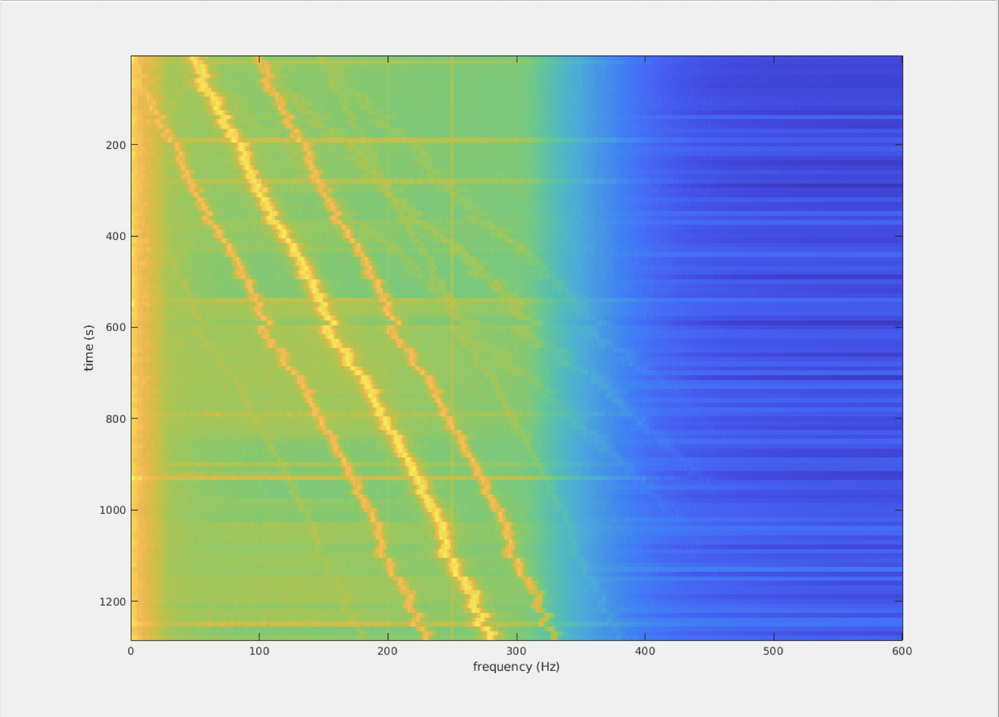

***************************************************************************
Am I affected by the early 2022 RF artifact, and what can be done about it?
***************************************************************************

What's wrong?
=============

Early 2022 the MEG seems to be affected (occasionally) by a high-frequency artifact that seems to be caused by RF-noise entering the MSR, which interacts with the MEG electronics to generate a high frequency artifact in the signals that drifts over time (in terms of peak frequency). The frequency of the artifact is usually well beyond the physiological range, so can be dealt with by lowpass filtering. However, sometimes the peak frequency drifts into the range of phsysiological activity, which makes lowpass filtering useless. 

How to check how bad it is in my data?
======================================

If you haven't noticed anything weird upon data acquisition, you are probably not affected. However, if you are worried that you are affected, it suffices to compute a powerspectrum (over time), of a bunch of MEG channels that are known to be affected most. To inspect your data, you can use some of the code that is pasted below in this FAQ.

Do I need to do something about it?
===================================

If your data is affected, it depends a bit on the data analysis requirements whether or not you need to do anything about this artifact. Specifically:

1. If the frequency range of the artifact is well above physiological frequencies you probably don't need to do anything but apply a well-chosen lowpass filter to your data.
2. If you intend to perform your crucial analysis in source space, using beamformers, you probably don't need to worry at all. The beamformer spatial filtering algorithm will be able to suppress signal sources that originate from outside the scanned dipole-locations-of-interest, so the artifact will probably be effectively suppressed. However, if the artifact is of high amplitude, the artifact will dominate the structure in the data covariance matrix, so some prior lowpass filtering may be required. Note also, that if you use a distributed source reconstruction technique, e.g. minimum norm estimation, then you are not off the hook, and you need to think a bit about proper noise regularisation.
3. If you intend to investigate your signals in the time domain (ERF), you might try a lowpass filter, provided condition 1 is met.

What can be done about it?
==========================
  
The morphology of the artifact is a (high frequency) peak in the spectrum, with 2 flanking peaks at +/- 50 Hz, which reflect a beat with the powerline fluctuations. The centre frequency changes over time, is usually of sufficiently high frequency to make it disappear with a lowpassfilter with a cutoff that does not affect physiological frequencies. However, sometimes the peak (likely reflecting a beat between two system clocks) is drifting into lower frequencies. In the test datasets used to come up with the cleanup recipe, the spatial distribution of the artifact does not suggest a far away source, which make 3d order gradient balancing useless. A generic solution might be to use PCA (based on the MEG channels), where the strategy would be to sensitize
the data for the drifting artifact, requiring a per segment peak detection. This leads to the following steps: 

1) read in the data in chunks of 5 s (focus on MLT and MRT which seem anecdotally most often affected), 
2) do spectral transformation, 
3) detect the peak using the +/- 50 Hz morphology, 
4) read in MEG data from all channels, 
5) band-pass filter with an optimized frequency band per trial, 
6) perform PCA, 
7) identify the to-be-rejected topographies,
8) store the identified topographies to-be-used on the data-of-interest.

.. code-block:: matlab

  %% 1) read in subset of data for artifact peak detection
  cfg = [];
  cfg.dataset = dataset; % define dataset to be the name of the dataset that you want to analyse/clean
  hdr = ft_read_header(cfg.dataset);

  % quick and dirty 5 second chunks
  N        = hdr.nSamples*hdr.nTrials;
  trl      = [1:6000:(N-5999);6000:6000:N]';
  trl(:,3) = 0;

  cfg.trl = trl(1:2:end,:);
  cfg.channel = {'MLT' 'MRT'};%'MEG';
  cfg.demean  = 'yes';
  cfg.continuous = 'yes';
  cfg.dftfilter = 'yes';
  cfg.hpfilter  = 'yes';
  cfg.hpfreq    = 0.5;
  cfg.hpfilttype = 'firws';
  data = ft_preprocessing(cfg);

  %% 2) spectral transformation
  cfg        = [];
  cfg.method = 'mtmfft';
  cfg.output = 'pow';
  cfg.foilim = [0 600];
  cfg.keeptrials = 'yes';
  cfg.tapsmofrq  = 1;
  freq       = ft_freqanalysis(cfg, data);

  % show what it looks like
  figure; imagesc(freq.freq, 10*(1:numel(freq.cumtapcnt)), squeeze(mean(log10(freq.powspctrm),2)));
  xlabel('frequency (Hz)');
  ylabel('time (s)');

.. code-block:: matlab

  %% 3) detect peak to be used for PCA preprocessing
  pow   = squeeze(mean(log10(freq.powspctrm),2));
  pow   = imgaussfilt(pow, 2); % requires imageprocessing toolbox
  freqs = freq.freq; 
  n     = numel(freqs);

  % make reference signal for cross-correlation
  sel   = nearest(freqs, [0 50]);
  sel   = [sel diff(sel)+sel(2)]; % three 'peaks' 50 Hz apart
  ref   = zeros(1, max(sel));
  ref(sel) = 1;
  ref   = [zeros(1,(n-numel(ref))/2) ref zeros(1,(n-numel(ref))/2)];
  ref   = convn(ref, hanning(20)', 'same');
  ref   = ref-mean(ref);
  for m = 1:size(pow,1)  
    pow_ = pow(m,:) - mean(pow(m,:));
    [X(m,:), lags] = xcorr(pow_, ref, 'coeff');
  end
  X = imgaussfilt(X, 2); % filter once more
  for m = 1:size(X,1)
    [dummy, M(m,1)] = max(X(m,:));
  end
  M = M - (n-1)./2;

  figure; hold on;
  imagesc(pow);
  plot(M, 1:size(pow,1), 'wo');
  axis xy; axis tight

The figure appears upside down with respect to the previous one: don't worry about it, that's a MATLAB plotting feature.

.. code-block:: matlab

  bpfreq = freqs(M)' + repmat([-5 5], [numel(M) 1]);

  %% 4) read in the MEG data (now all channels)
  cfg = [];
  cfg.dataset = dataset;
  cfg.trl = trl(1:2:end,:);
  cfg.channel = 'MEG';
  cfg.demean  = 'yes';
  cfg.continuous = 'yes';
  data = ft_preprocessing(cfg);

  %% 5) bandpass filter per trial
  dataorig = data;
  for m = 1:numel(data.trial)
    data.trial{m} = ft_preproc_bandpassfilter(data.trial{m}, 1200, bpfreq(m,:), [], 'firws');
  end

  %% 6) PCA
  cfg          = [];
  cfg.method   = 'pca';
  %cfg.cellmode = 'yes'; % note this does not work yet, let's hope you have enough RAM
  comp         = ft_componentanalysis(cfg, data);

  V = zeros(numel(comp.label), numel(comp.trial));
  for m = 1:numel(comp.trial)
    V(:,m) = var(comp.trial{m},[],2);
  end
  figure;plot(log10(mean(V,2)),'o');
  ylabel('variance (T^2)');
  xlabel('component #');

  cfg = [];
  cfg.component = 1:4;
  cfg.layout = 'CTF275_helmet.mat';
  ft_topoplotIC(cfg, comp);

  %% 7) reject components and evaluate the effect
  Vm = mean(V, 2)';
  Vm = Vm./Vm(1);
  cfg = [];
  cfg.component = find(Vm>0.01); % this may be specific to the dataset
  data = ft_rejectcomponent(cfg, comp, dataorig);

  cfg        = [];
  cfg.method = 'mtmfft';
  cfg.output = 'pow';
  cfg.foilim = [0 600];
  cfg.keeptrials = 'yes';
  cfg.tapsmofrq  = 1;
  freqorig   = ft_freqanalysis(cfg, dataorig);
  freq       = ft_freqanalysis(cfg, data);

  % show what it looks like
  figure; imagesc(freq.freq, 10*(1:numel(freq.cumtapcnt)), squeeze(mean(log10(freqorig.powspctrm),2)));
  xlabel('frequency (Hz)');
  ylabel('time (s)');
  title('pre cleaning');

  figure; imagesc(freq.freq, 10*(1:numel(freq.cumtapcnt)), squeeze(mean(log10(freq.powspctrm),2)));
  xlabel('frequency (Hz)');
  ylabel('time (s)');
  title('post cleaning');

  figure; hold on
  sel = match_str(data.label, 'MLT32');
  plot(dataorig.time{1}, dataorig.trial{1}(sel,:));
  plot(data.time{1}, data.trial{1}(sel,:));
  xlim([0.5 1.5]);
  xlabel('time (s');
  ylabel('MEG amplitude (T)');
